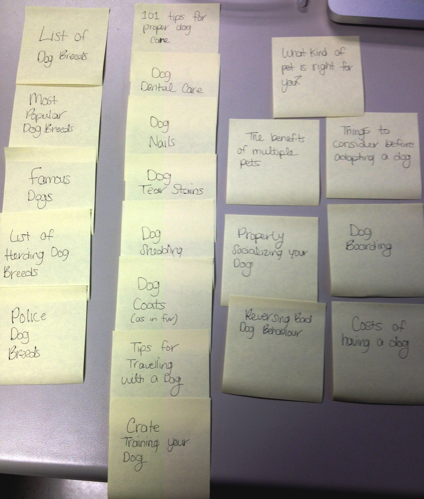

# Card sort report

The purpose of this card sort was to determine common navigation patterns and categories from the content of Dogs.

## Specifics

The card sort was conducted by Stephanie Csanky on Tuesday September 10th, 2013 between the times of 9:30a.m. and 10:00a.m. with the following participants:

- Lianne Hebert
- Laura Harvey

### Cards

20 cards were used covering a broad range of applicable content for the website. The following topics were used as cards:

1. List of Dog Breeds
2. Police Dog Breeds
3. List of Famous Dogs
4. Most Popular Dog Breeds
5. Dog Tear Stains
6. Dog Coats
7. Dog Shedding
8. Dog Nails
9. Dog Dental Care
10. List of Herding Dog Breeds
11. Tips for Traveling with a Dog
12. 101 Tips for proper dog care
13. Dog boarding
14. Reversing Bad Dog Behaviour
15. Properly Socializing your Dog
16. Crate Training your Dog
17. The benefits of multiple pets
18. What kind of pet is right for you?
19. Cost of Owning a Dog
20. Things to consider before adopting a dog

## Card sort results

*Card sort 1 by Lianne Hebert*

*Card sort 2 by Laura Harvey*

## Observations

- Did the participants have any common comments? The only comments from the participants was that they felt as though they managed to sort the cards with ease.
- Did they have questions that stood out? Both participants had no questions during their sorting.
- Did they struggle with certain articles or topics? Not at all.
- Did they find common groupings? Or were the groupings completely different? Both participants found similar groupings. They listed all breed-related topics together. I noticed that in Card sort 2, Laura chose to create a separate category for travelling with or without your dog, which I thought was pretty clever because I have 3 topics regarding pet travel. Lianne chose to have three broader categories including Breed information, Tips and then a general category that covers things a soon-to-be pet owner should know. In some ways both card sorting participants had similar groupings and in some ways did not.
- Were some of the groupings completely unexpected? I did not expect Laura to create five categories, but when I looked over it, I liked how it broke topics down in a way which I did not think of. In my head I was going to have a 'Tips' category but I think I will use categories similar to how Laura did it during her card sort.
- Were the results similar to your expectations? Yes the results were very similar to my expectations because the topics make it really obvious as to which category they belong in but as I explained above, I did not expect the result of Laura's card sort, although it makes complete sense.
- How did you feel while watching them perform the task? I didn't not really have much opinion about it, except I was pleased to see both participants sorted the cards similar to how I would and they managed to do it with ease.